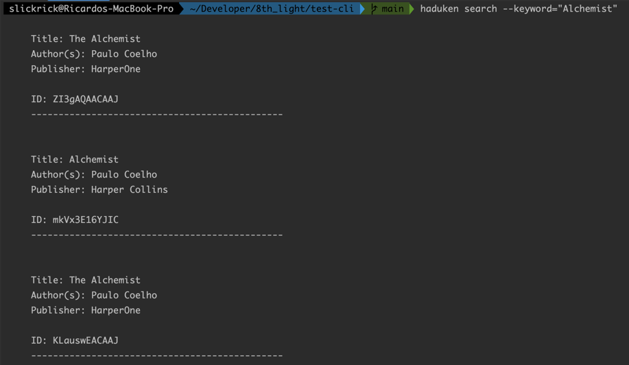
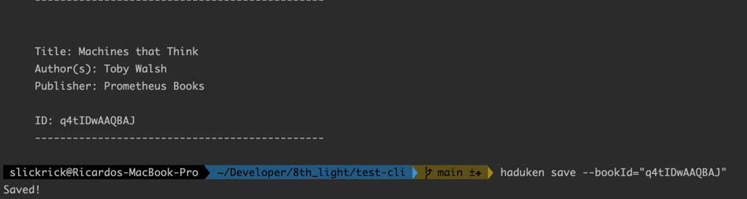
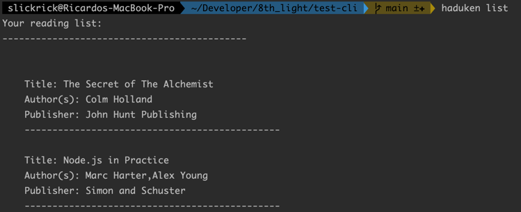

# test-cli
This command line application allows the user to search for a book, utilizing Google's Books API. A user can save a book to their reading list by using that books ID and also print their created reading list. You can use any term to search for a book and are not limited to just a book's title e.g. author's name, keyword, etc.

 First, make sure to clone the application into a directory of your choosing.
Then use the **npm install** command to install the dependency packages.

**ALSO**, installing the app globally will allow you to use the **_haduken_** starting command to utilize the application.

> $ npm install -g
# How to use the application

There are 3 commands:
- Search
- Save
- List

Only two of the commands, **(search & save)**, have builder properties.

- search **--keyword**
- save **--bookId**

> **$ haduken search --keyword="_the book you are looking for_"**

> 

> **$ haduken save --bookId="_number id of the book you would like to save_"**

>

Finally, use the **list** command to print the reading list. This list command does not have a builder property so nothing else is needed.

> **$ haduken list**

> 
